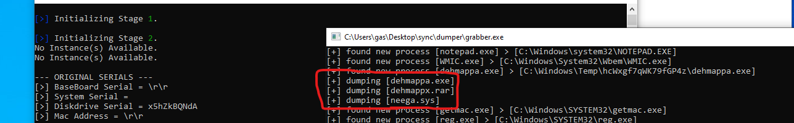
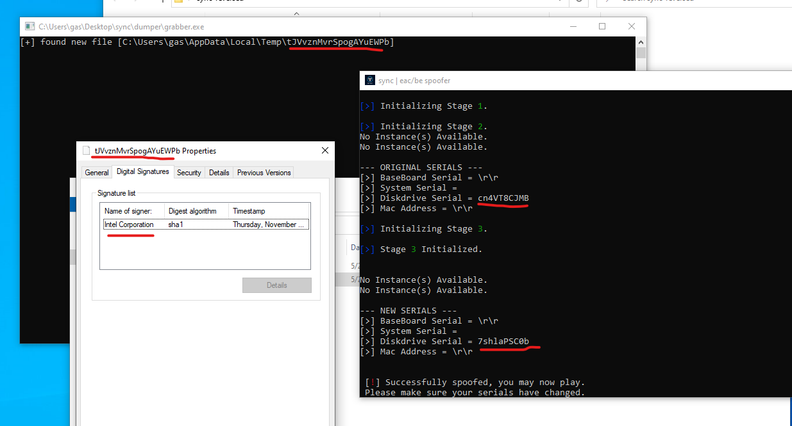
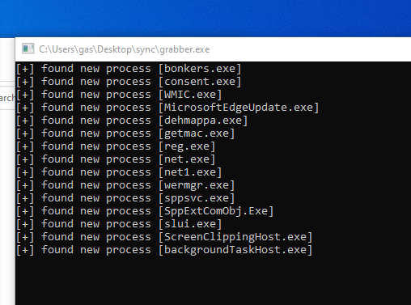
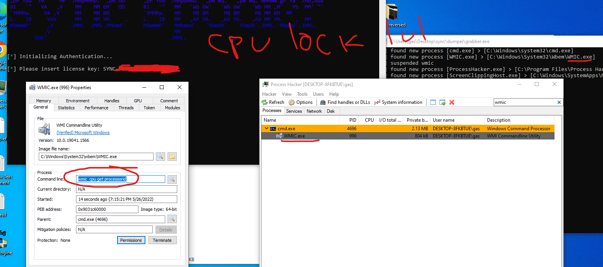
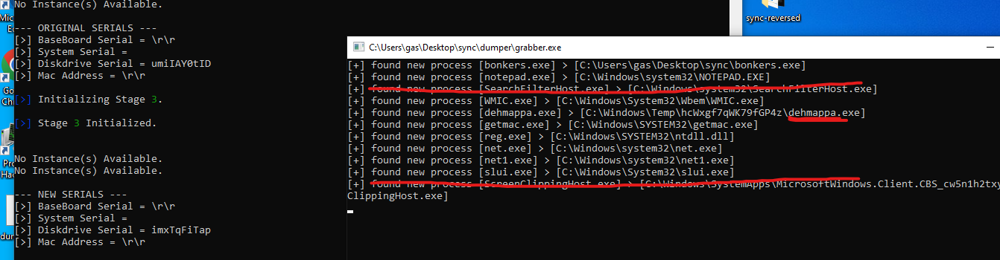

# sync-spoofer-reversal
Public pasted spoofer that claims to work on eac be and vgk, but i have not found this to be true.

## Installation Procedure
1. Run loader, login, to load the EFI driver it swaps bootmgfw.efi (xerox's method) and pends restart
2. Requires you to uninstall OneDrive and logout of your Microsoft Account
3. Run loader after restart again to get some other pasted driver to map.

## Reversal Procedure
1. Firstly i tried to see how they are loading the efi file and since the process is automatic its using the common method of swapping bootmgfw.efi so it was a easy grab
2. Then i read in the instructions that i know need to also load a second driver manually and when trying to fetch the vulnerable i saw it being written in temp folder and saw its signed by intel (kdmapper)
3. then for mapper/driver i noticed they don't even map the driver from the loader itself, they put the mapper and driver in a temp folder, map & delete (extremely poor work)
4. lastly i was interested in their hwid system and dissapointed again to find out they do run wmic.exe to get the processorid and use that for a hwid lock.

